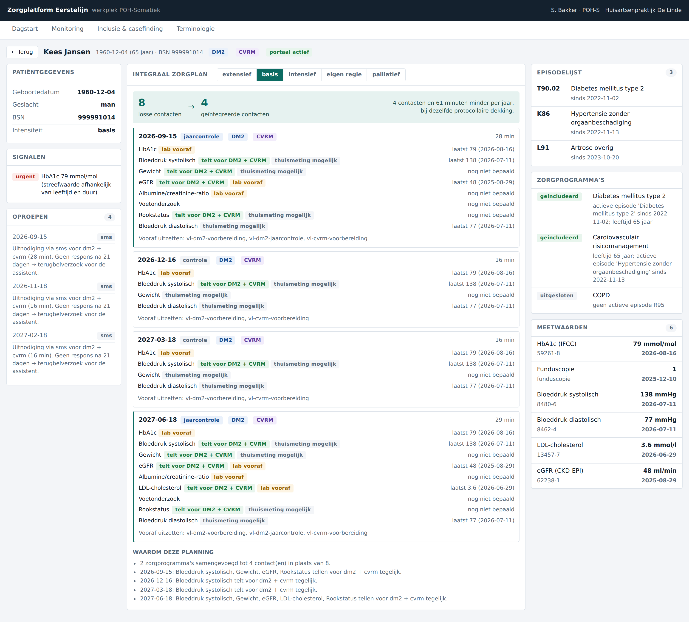

# Zorgplatform Eerstelijn

Een FHIR-native, procesgedreven informatiesysteem voor de Nederlandse eerste lijn —
gebouwd rond het zorgteam en het zorgproces in plaats van rond de solo-huisarts en
het dossier.

> **Status: fase 0 — fundament.** Deze repo bevat de architectuur, het datamodel, de
> terminologielaag, de zorgprogrammamotor en een werkende werkplek voor de
> POH-Somatiek op synthetische data. Nog geen productiesysteem.

---

## Waarom

De huidige generatie HIS'en is een uitstekende oplossing voor het probleem van 2005:
één huisarts, één dossier, één probleem tegelijk. De praktijk van vandaag is anders —
een team, doorlopende chronische zorg, multimorbiditeit — en dat verschil kost tijd
die er niet is. Meer dan de helft van de werktijd van een POH gaat op aan
administratie en logistiek.

Drie concrete voorbeelden uit de bestaande systemen (zie [`docs/10`](docs/10-analyse-bestaande-hissen.md)):

- Inclusie in ketenzorg gebeurt via een datadump naar Excel en handmatig terugregistreren.
- Een patiënt met DM2 + CVRM + COPD doorloopt drie protocollen en komt tot acht keer
  per jaar langs voor grotendeels dezelfde metingen.
- Een ingevulde vragenlijst belandt als losse regels tekst in het journaal. Er gebeurt
  niets mee — geen trend, geen trigger, geen terugkoppeling.

## Wat deze repo aantoont

| Claim | Waar het zit | Bewijs |
| --- | --- | --- |
| Inclusie kan in het dossier zelf, zonder Excel | `packages/care-engine/src/inclusie.ts` | Live kandidatenlijst met onderbouwing per patiënt |
| Drie zorgpaden worden één plan | `packages/care-engine/src/zorgplan.ts` | 8 losse contacten → 4 geïntegreerde, bij gelijke protocollaire dekking |
| ICPC en SNOMED kunnen naast elkaar | `packages/terminology/` | Drie registratieniveaus; externe codes komen binnen zonder het origineel te vervangen |
| Een vragenlijst is een motor | `packages/care-engine/src/vragenlijst.ts` | Antwoord → score → trend → taak, notificatie, afspraak of protocolwijziging |
| Het systeem stelt óók voor om mínder te doen | trigger `ccq-stabiel-afschalen` | Drie stabiele metingen → voorstel intensiteit `extensief` |



*Eén patiënt, twee zorgprogramma's, acht losse contacten teruggebracht tot vier —
met per meting zichtbaar voor welke programma's zij telt.*

---

## Snel starten

```bash
npm install
npm run build
npm test            # 28 tests over terminologie, inclusie, planning en vragenlijsten

npm run api         # API op http://localhost:3000
npm run web         # werkplek op http://localhost:5173
```

De API genereert bij het starten een deterministische synthetische praktijk van
48 patiënten. **Nooit productiedata in ontwikkel- of testomgevingen** — daarom is
populatiegeneratie onderdeel van de toolchain ([`docs/07` §4](docs/07-compliance.md)).

Losse endpoints om mee te spelen:

```bash
curl localhost:3000/api/praktijk/samenvatting
curl localhost:3000/api/poh/dagstart
curl localhost:3000/api/inclusie/kandidaten
curl 'localhost:3000/api/terminologie/zoek?q=suikerziekte'
curl localhost:3000/fhir/metadata
curl 'localhost:3000/fhir/CarePlan?patient=pat-001'
```

---

## Indeling

```
docs/           architectuur, ontwerpbesluiten en de analyse van bestaande systemen
packages/
  fhir-model/   FHIR R4-typen, herkomst, dossier-views
  terminology/  ICPC-1 NL ↔ SNOMED CT, referentieset, zoeken, ontvangst
  care-engine/  zorgprogramma's, inclusie, integraal zorgplan, vragenlijstmotor, oproep
apps/
  api/          FHIR-facade + taakgerichte endpoints per werkplek + synthetische populatie
  web/          werkplek POH-Somatiek
```

Modulegrenzen: `terminology` kent `fhir-model`; `care-engine` kent beide maar bevat
geen HTTP en geen opslag; `apps/*` bevatten geen klinische regels.

## Documentatie

| | |
| --- | --- |
| [00 — Visie en scope](docs/00-visie-en-scope.md) | Het probleem, wat we bouwen, meetbare doelen |
| [01 — Architectuur](docs/01-architectuur.md) | Lagen, de drie database-assen, technologiekeuzes |
| [02 — Terminologie](docs/02-terminologie.md) | ICPC/SNOMED, referentieset vs. extern, mapping-import |
| [03 — Datamodel](docs/03-datamodel.md) | Episode, deelcontact, herkomst, zorgplan, werkvoorraad |
| [04 — Zorgproces](docs/04-zorgproces.md) | Casefinding, samenvoeglogica, intensiteit, oproep |
| [05 — Werkplekken](docs/05-werkplekken.md) | POH-S, assistent, huisarts, patiënt |
| [06 — Vragenlijsten](docs/06-vragenlijsten.md) | Triggermodel, twee presentaties, MDR-aanpak |
| [07 — Compliance](docs/07-compliance.md) | AVG, NEN 7510/12/13, Wegiz, EHDS, MDR, AI Act |
| [08 — Interoperabiliteit](docs/08-interoperabiliteit.md) | Profielen, adressering, de API als product |
| [09 — Roadmap](docs/09-roadmap.md) | Fasering, risico's, wat er nodig is |
| [10 — Analyse bestaande HIS'en](docs/10-analyse-bestaande-hissen.md) | mediKIT, HealthConnected, Bricks |
| [11 — Applicatiefunctiemodel](docs/11-applicatiefunctiemodel.md) | AHA-model als functiedecompositie |
| [12 — Procesmodel](docs/12-procesmodel.md) | De swimlanes, uitgewerkt naar uitvoerbare definities |
| [ADR's](docs/adr/) | Zes vastgelegde ontwerpbesluiten met alternatieven |

---

## Belangrijke waarschuwingen

**Demoterminologie.** `packages/terminology/src/seed.ts` bevat een kleine set met
échte SNOMED-concept-id's en ICPC-codes, maar de selectie is willekeurig en de
mapping-equivalenties zijn niet door een terminoloog gereviewd. **Niet voor klinisch
gebruik.** Vervangen door de NHG/Nictiz-distributie plus de mapping van de
opdrachtgever; het inleesformaat staat in [`docs/02` §6](docs/02-terminologie.md).

**Meetinstrumenten.** De vragenlijsten in `vragenlijsten-demo.ts` bootsen de
structuur en scoringslogica van bestaande instrumenten na met eigen formuleringen.
CCQ, PHQ-9, GAD-7 en EQ-5D zijn auteursrechtelijk beschermd en vragen een licentie
voor digitaal gebruik. Vóór praktijkgebruik vervangen door de officiële items.

**Klinische inhoud.** Drempelwaarden en protocolintervallen in
`zorgprogramma.ts` zijn plausibel maar niet geverifieerd tegen de actuele
NHG-standaarden. Ze dienen om de motor te bouwen, niet om zorg mee te leveren.

---

## Wat er nu nodig is

1. De **ICPC-1 NL ↔ SNOMED-mapping** in het formaat uit [`docs/02` §6](docs/02-terminologie.md).
2. **Bevestiging** van de lezing van het AHA-functiemodel: oranje = "nu niet of
   onvoldoende ondersteund" ([`docs/11`](docs/11-applicatiefunctiemodel.md)).
3. **Keuze van het eerste zorgprogramma** voor diepe uitwerking (voorstel: DM2).
4. **Een echt protocol** van een zorggroep of de AHA, om de motor tegen de
   werkelijkheid te toetsen.
5. **Eén of twee praktijken** als klankbord — nu, niet aan het eind.
