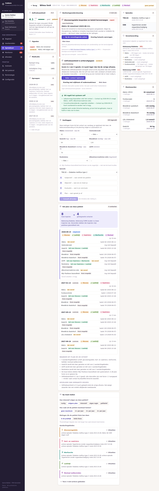
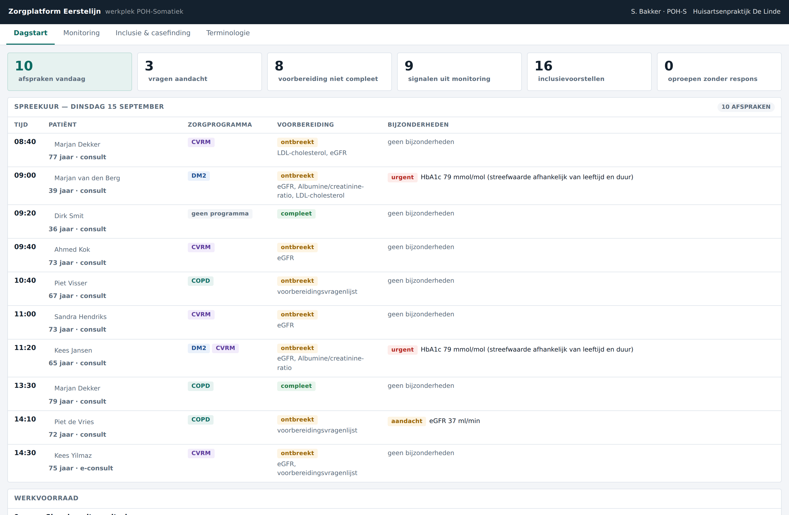

# Zorgplatform Eerstelijn

Een FHIR-native, procesgedreven informatiesysteem voor de Nederlandse eerste lijn —
gebouwd rond het zorgteam en het zorgproces, met **één geïntegreerd protocol** in plaats
van een zorgprogramma per aandoening.

> **Status: fase 0 — fundament.** Architectuur, datamodel, terminologielaag, het
> geïntegreerde protocol, beslissingsondersteuning en een werkende werkplek voor de
> POH-Somatiek op synthetische data. Nog geen productiesysteem.

---

## De kern: geen protocol per aandoening

Een mens heeft zelden één probleem. Zodra de aandoening het organiserende principe wordt,
krijg je onvermijdelijk losse trajecten, losse oproepen en losse consulten — en dat is
precies wat elk bestaand systeem doet.

Daarom is de bouwsteen hier geen aandoening maar een **aandachtsgebied**:

> glucoseregulatie · hart- en vaatrisico · nierfunctie · ademhaling · leefstijl ·
> mentaal welbevinden · medicatieveiligheid · kwetsbaarheid

Drie lagen bepalen het plan, in deze volgorde ([`docs/04`](docs/04-zorgproces.md)):

1. **het protocol** — welke gebieden zijn relevant, wat is het basisinterval;
2. **de situatie** — HbA1c twee metingen onder 53 → halfjaarlijks; boven 64 → zes weken.
   Niet het ziektelabel maar de toestand bepaalt de frequentie;
3. **de persoon** — gebieden aan of uit met reden, eigen intervallen, een eigen maximum
   aantal contacten per jaar, thuis meten in plaats van langskomen.

Laag 3 wint altijd van 1 en 2, mits de reden wordt vastgelegd.

Landelijke ketenzorg (DM, CVRM, COPD, ouderenzorg) verdwijnt niet — die is nodig voor
declaratie. Maar het is een **projectie achteraf**: niemand registreert "voor de keten".
Zie [ADR-0007](docs/adr/ADR-0007-een-geintegreerd-protocol.md).



*Het consultscherm: beslissingsondersteuning bovenaan (met de feiten vóór het advies),
daaronder registreren, dan het plan — en rechts de verantwoording die zichzelf vult.*

---

## Wat deze repo aantoont

| Claim | Waar | Bewijs |
| --- | --- | --- |
| Eén plan, geen programma's | `packages/care-engine/src/protocol.ts` | Nergens in de werkplek kies je een zorgprogramma |
| Het interval volgt uit de situatie | `zorgplan.ts` — intervalregels | Dezelfde diagnose, andere frequentie, afhankelijk van de waarden |
| Echt op maat | `PersoonlijkPlan` | "Maximaal 2× per jaar" past het hele plan aan, mét benoemde consequenties |
| Minder contacten bij multimorbiditeit | `vergelijking` | 8 losse trajectcontacten → 4 geïntegreerde bij dezelfde dekking |
| Verantwoording vult zichzelf | `ketenkoppeling.ts` | Eén registratie → ketenindicatoren van 29% naar 100%, zonder apart invulwerk |
| Automatiseren wat mag | `beslisondersteuning.ts` | 58% van het gesignaleerde werk is logistiek en draait zonder mens |
| Het systeem stelt óók voor om mínder te doen | regel `afschalen-stabiel` | Drie stabiele metingen → voorstel om af te schalen |
| ICPC en SNOMED naast elkaar | `packages/terminology` | Externe codes landen met context, zonder het origineel te vervangen |

### Eerlijk over de cijfers

Op de demopraktijk van 48 patiënten: **15 contacten per jaar minder**, maar de
consulttijd stijgt met ongeveer **5 uur per jaar**. Dat is geen weeffout — het plan
dóét meer. Mentaal welbevinden (27 patiënten), medicatiebeoordeling (6) en
kwetsbaarheid dekt geen enkele keten systematisch. Beide getallen staan in de API met
teken; één ervan verzwijgen zou het cijfer waardeloos maken.

Nog een bevinding uit dezelfde cijfers: van de 34 patiënten met een chronische zorgvraag
vallen er **7 onder geen enkele landelijke keten**. Die krijgen nu geen gestructureerde
begeleiding — ze bestaan simpelweg niet in de ketenadministratie.

---

## De werkplek volgt het werkproces

Niet het dossier maar de dag van de POH is de navigatie:

**Dagstart** → **Voorbereiden** → **Spreekuur** → **Monitoren** → **Afronden**

Per stap staat in het scherm letterlijk wát je daar ziet en wát je kunt doen.



---

## Snel starten

```bash
npm install
npm run build
npm test            # 44 tests: terminologie, protocol, planning, beslisregels, vragenlijsten

npm run web         # werkplek op http://localhost:5173 — draait zónder server
```

De werkplek draait standaard **volledig in de browser**: `@zpe/praktijk` bevat geen HTTP
en geen Node-afhankelijkheden, dus dezelfde motor die in de server draait, draait ook in
het tabblad. Handig voor demo's, maar vooral een bewijs dat de domeinlaag echt losstaat
van het transport — voorwaarde voor de FHIR-facade uit [`docs/08`](docs/08-interoperabiliteit.md).

Wil je tegen de echte API aan werken (dezelfde endpoints die externe partijen zien):

```bash
npm run api                              # Fastify op http://localhost:3000
VITE_BACKEND=http npm run web            # werkplek praat nu over HTTP

npm --workspace @zpe/web run build:standalone   # losstaande bundel, zonder server
```

De API genereert bij het starten een deterministische synthetische praktijk van
48 patiënten. **Nooit productiedata in ontwikkel- of testomgevingen** — daarom is
populatiegeneratie onderdeel van de toolchain ([`docs/07` §4](docs/07-compliance.md)).

```bash
curl localhost:3000/api/praktijk/samenvatting
curl localhost:3000/api/protocol            # het volledige protocol, met intervalregels
curl localhost:3000/api/poh/dagstart
curl localhost:3000/api/poh/instroom
curl 'localhost:3000/api/terminologie/zoek?q=suikerziekte'
curl 'localhost:3000/fhir/CarePlan?patient=pat-001'
```

---

## Indeling

```
docs/           architectuur, ontwerpbesluiten en de analyse van bestaande systemen
packages/
  fhir-model/   FHIR R4-typen, herkomst, dossier-views
  terminology/  ICPC-1 NL ↔ SNOMED CT, referentieset, zoeken, ontvangst
  care-engine/  protocol · ketenkoppeling · instroom · zorgplan · beslisondersteuning
                · vragenlijsten · oproep
  praktijk/     samenstelling tot schermen + synthetische praktijk — géén HTTP
apps/
  api/          FHIR-facade en werkproces-endpoints over `praktijk`
  web/          werkplek POH-Somatiek (browser of HTTP, zelfde interface)
```

Modulegrenzen: `terminology` kent `fhir-model`; `care-engine` kent beide maar bevat geen
HTTP en geen opslag; `apps/*` bevatten geen klinische regels.

## Documentatie

| | |
| --- | --- |
| [00 — Visie en scope](docs/00-visie-en-scope.md) | Het probleem, wat we bouwen, meetbare doelen |
| [01 — Architectuur](docs/01-architectuur.md) | Lagen, de drie database-assen, technologiekeuzes |
| [02 — Terminologie](docs/02-terminologie.md) | ICPC/SNOMED, referentieset vs. extern, mapping-import |
| [03 — Datamodel](docs/03-datamodel.md) | Episode, deelcontact, herkomst, zorgplan, werkvoorraad |
| [04 — Het geïntegreerde protocol](docs/04-zorgproces.md) | Aandachtsgebieden, de drie lagen, instroom, ketenprojectie |
| [05 — Werkplekken](docs/05-werkplekken.md) | POH-S, assistent, huisarts, patiënt |
| [06 — Vragenlijsten](docs/06-vragenlijsten.md) | Triggermodel, twee presentaties, MDR-aanpak |
| [07 — Compliance](docs/07-compliance.md) | AVG, NEN 7510/12/13, Wegiz, EHDS, MDR, AI Act |
| [08 — Interoperabiliteit](docs/08-interoperabiliteit.md) | Profielen, adressering, de API als product |
| [09 — Roadmap](docs/09-roadmap.md) | Fasering, risico's, wat er nodig is |
| [10 — Analyse bestaande HIS'en](docs/10-analyse-bestaande-hissen.md) | mediKIT, HealthConnected, Bricks |
| [11 — Applicatiefunctiemodel](docs/11-applicatiefunctiemodel.md) | AHA-model als functiedecompositie |
| [12 — Procesmodel](docs/12-procesmodel.md) | De swimlanes, uitgewerkt naar uitvoerbare definities |
| [13 — Beslissingsondersteuning](docs/13-beslissingsondersteuning.md) | Klinisch vs. logistiek, automatisering, MDR |
| [ADR's](docs/adr/) | Zeven vastgelegde ontwerpbesluiten met alternatieven |

---

## Belangrijke waarschuwingen

**Demoterminologie.** `packages/terminology/src/seed.ts` bevat een kleine set met échte
SNOMED-concept-id's en ICPC-codes, maar de selectie is willekeurig en de
mapping-equivalenties zijn niet door een terminoloog gereviewd. **Niet voor klinisch
gebruik.** Vervangen door de NHG/Nictiz-distributie plus de mapping van de opdrachtgever;
het inleesformaat staat in [`docs/02` §6](docs/02-terminologie.md).

**Meetinstrumenten.** De vragenlijsten in `vragenlijsten-demo.ts` bootsen de structuur en
scoringslogica van bestaande instrumenten na met eigen formuleringen. CCQ, PHQ-9, GAD-7
en EQ-5D zijn auteursrechtelijk beschermd en vragen een licentie voor digitaal gebruik.

**Klinische inhoud.** Drempelwaarden, intervallen en beslisregels in `protocol.ts` en
`beslisondersteuning.ts` zijn plausibel maar niet geverifieerd tegen de actuele
NHG-standaarden. Ze dienen om de motor te bouwen, niet om zorg mee te leveren.

---

## Wat er nu nodig is

1. De **ICPC-1 NL ↔ SNOMED-mapping** in het formaat uit [`docs/02` §6](docs/02-terminologie.md).
2. **Bevestiging** van de lezing van het AHA-functiemodel: oranje = "nu niet of
   onvoldoende ondersteund" ([`docs/11`](docs/11-applicatiefunctiemodel.md)).
3. **Toetsing van de acht aandachtsgebieden** met een POH en een kaderhuisarts: zijn dit
   de juiste gebieden, en kloppen de relevantieregels?
4. **Een echt protocol** van een zorggroep of de AHA, om de intervalregels tegen de
   praktijk te toetsen — te beginnen bij hart- en vaatrisico.
5. **Eén of twee praktijken** als klankbord, nu al.
